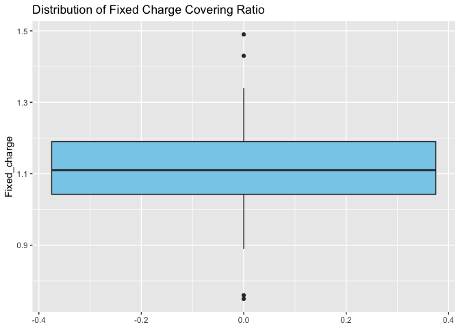
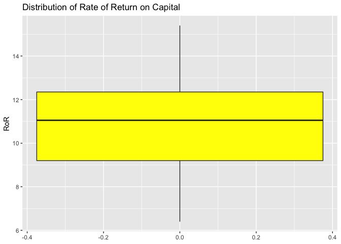
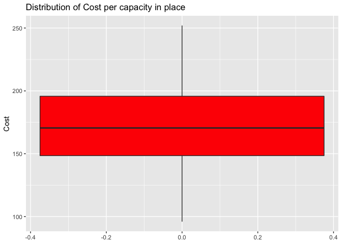
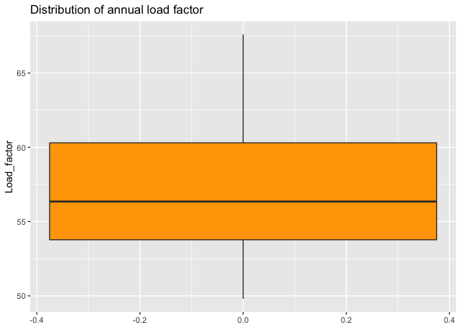
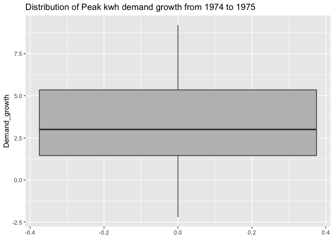
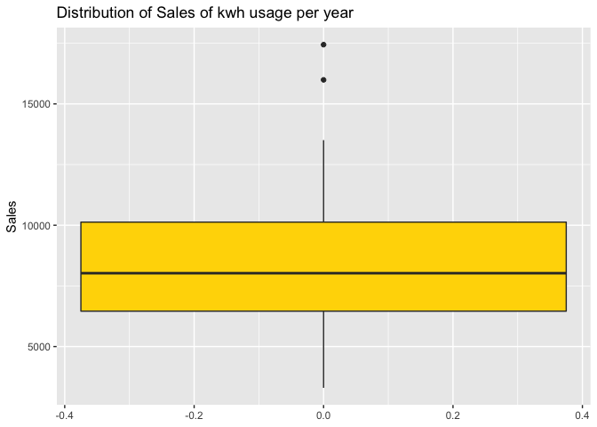
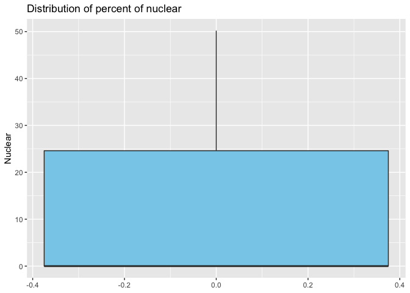
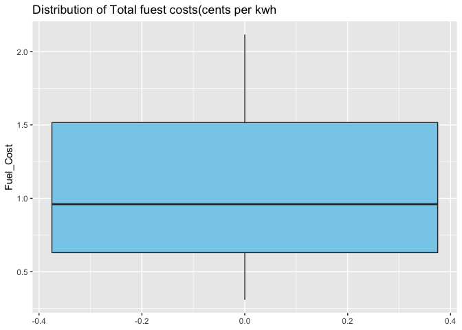
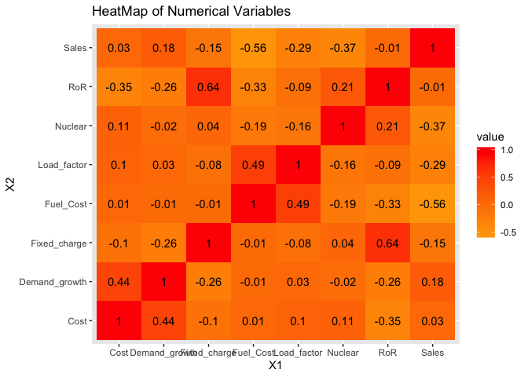

## This code focuses on principal component analysis on the data of Public utilities companies in the USA.

Overview of 22 Public Utility Companies in the USA
================
Manoj Bhandari

### **Install and Load Data Table Package**

``` r
if(!require("data.table")) install.packages("data.table")
```

    ## Loading required package: data.table

### **Read the Utilities file and store it in a data table**

  - Read the file using read.csv()
  - Store the file contents as data.table
  - Display the data.table
  - This variable is used throughout all the questions whenever
    utilities data is required

<!-- end list -->

``` r
utilities <- read.csv(file = "Utilities.csv")
util.dt <- setDT(utilities)
util.dt
```

    ##          Company Fixed_charge  RoR Cost Load_factor Demand_growth Sales
    ##  1:     Arizona          1.06  9.2  151        54.4           1.6  9077
    ##  2:      Boston          0.89 10.3  202        57.9           2.2  5088
    ##  3:     Central          1.43 15.4  113        53.0           3.4  9212
    ##  4: Commonwealth         1.02 11.2  168        56.0           0.3  6423
    ##  5:           NY         1.49  8.8  192        51.2           1.0  3300
    ##  6:     Florida          1.32 13.5  111        60.0          -2.2 11127
    ##  7:    Hawaiian          1.22 12.2  175        67.6           2.2  7642
    ##  8:        Idaho         1.10  9.2  245        57.0           3.3 13082
    ##  9:     Kentucky         1.34 13.0  168        60.4           7.2  8406
    ## 10:     Madison          1.12 12.4  197        53.0           2.7  6455
    ## 11:       Nevada         0.75  7.5  173        51.5           6.5 17441
    ## 12:  New England         1.13 10.9  178        62.0           3.7  6154
    ## 13:     Northern         1.15 12.7  199        53.7           6.4  7179
    ## 14:     Oklahoma         1.09 12.0   96        49.8           1.4  9673
    ## 15:     Pacific          0.96  7.6  164        62.2          -0.1  6468
    ## 16:        Puget         1.16  9.9  252        56.0           9.2 15991
    ## 17:    San Diego         0.76  6.4  136        61.9           9.0  5714
    ## 18:     Southern         1.05 12.6  150        56.7           2.7 10140
    ## 19:        Texas         1.16 11.7  104        54.0          -2.1 13507
    ## 20:    Wisconsin         1.20 11.8  148        59.9           3.5  7287
    ## 21:       United         1.04  8.6  204        61.0           3.5  6650
    ## 22:     Virginia         1.07  9.3  174        54.3           5.9 10093
    ##          Company Fixed_charge  RoR Cost Load_factor Demand_growth Sales
    ##     Nuclear Fuel_Cost
    ##  1:     0.0     0.628
    ##  2:    25.3     1.555
    ##  3:     0.0     1.058
    ##  4:    34.3     0.700
    ##  5:    15.6     2.044
    ##  6:    22.5     1.241
    ##  7:     0.0     1.652
    ##  8:     0.0     0.309
    ##  9:     0.0     0.862
    ## 10:    39.2     0.623
    ## 11:     0.0     0.768
    ## 12:     0.0     1.897
    ## 13:    50.2     0.527
    ## 14:     0.0     0.588
    ## 15:     0.9     1.400
    ## 16:     0.0     0.620
    ## 17:     8.3     1.920
    ## 18:     0.0     1.108
    ## 19:     0.0     0.636
    ## 20:    41.1     0.702
    ## 21:     0.0     2.116
    ## 22:    26.6     1.306
    ##     Nuclear Fuel_Cost

**Get the numeric values from Uitilities file and display the values**

``` r
util.num.values <- util.dt[,!"Company"]
util.num.values
```

    ##     Fixed_charge  RoR Cost Load_factor Demand_growth Sales Nuclear
    ##  1:         1.06  9.2  151        54.4           1.6  9077     0.0
    ##  2:         0.89 10.3  202        57.9           2.2  5088    25.3
    ##  3:         1.43 15.4  113        53.0           3.4  9212     0.0
    ##  4:         1.02 11.2  168        56.0           0.3  6423    34.3
    ##  5:         1.49  8.8  192        51.2           1.0  3300    15.6
    ##  6:         1.32 13.5  111        60.0          -2.2 11127    22.5
    ##  7:         1.22 12.2  175        67.6           2.2  7642     0.0
    ##  8:         1.10  9.2  245        57.0           3.3 13082     0.0
    ##  9:         1.34 13.0  168        60.4           7.2  8406     0.0
    ## 10:         1.12 12.4  197        53.0           2.7  6455    39.2
    ## 11:         0.75  7.5  173        51.5           6.5 17441     0.0
    ## 12:         1.13 10.9  178        62.0           3.7  6154     0.0
    ## 13:         1.15 12.7  199        53.7           6.4  7179    50.2
    ## 14:         1.09 12.0   96        49.8           1.4  9673     0.0
    ## 15:         0.96  7.6  164        62.2          -0.1  6468     0.9
    ## 16:         1.16  9.9  252        56.0           9.2 15991     0.0
    ## 17:         0.76  6.4  136        61.9           9.0  5714     8.3
    ## 18:         1.05 12.6  150        56.7           2.7 10140     0.0
    ## 19:         1.16 11.7  104        54.0          -2.1 13507     0.0
    ## 20:         1.20 11.8  148        59.9           3.5  7287    41.1
    ## 21:         1.04  8.6  204        61.0           3.5  6650     0.0
    ## 22:         1.07  9.3  174        54.3           5.9 10093    26.6
    ##     Fixed_charge  RoR Cost Load_factor Demand_growth Sales Nuclear
    ##     Fuel_Cost
    ##  1:     0.628
    ##  2:     1.555
    ##  3:     1.058
    ##  4:     0.700
    ##  5:     2.044
    ##  6:     1.241
    ##  7:     1.652
    ##  8:     0.309
    ##  9:     0.862
    ## 10:     0.623
    ## 11:     0.768
    ## 12:     1.897
    ## 13:     0.527
    ## 14:     0.588
    ## 15:     1.400
    ## 16:     0.620
    ## 17:     1.920
    ## 18:     1.108
    ## 19:     0.636
    ## 20:     0.702
    ## 21:     2.116
    ## 22:     1.306
    ##     Fuel_Cost

**Minimum values of Numeric variables**

Calculate the minimum value of all the numeric type columns by using
lapply() fucntion. Display the data

``` r
util.min <- util.dt[,lapply(util.num.values,min)]
util.min
```

    ##    Fixed_charge RoR Cost Load_factor Demand_growth Sales Nuclear Fuel_Cost
    ## 1:         0.75 6.4   96        49.8          -2.2  3300       0     0.309

**Maximum values of Numeric variables**

Calculate the maximum value of all the numeric type columns by using
lapply() fucntion. Display the data

``` r
util.max <- util.dt[,lapply(util.num.values,max)]
util.max
```

    ##    Fixed_charge  RoR Cost Load_factor Demand_growth Sales Nuclear
    ## 1:         1.49 15.4  252        67.6           9.2 17441    50.2
    ##    Fuel_Cost
    ## 1:     2.116

**Mean values of Numeric variables**

Calculate the mean value of all the numeric type columns by using
lapply() fucntion. Display the data

``` r
util.mean <- util.dt[,lapply(util.num.values,mean)]
util.mean
```

    ##    Fixed_charge      RoR     Cost Load_factor Demand_growth    Sales
    ## 1:     1.114091 10.73636 168.1818    56.97727      3.240909 8914.045
    ##    Nuclear Fuel_Cost
    ## 1:      12  1.102727

**Median values of Numeric variables**

Calculate the median value of all the numeric type columns by using
lapply() fucntion. Display the data

``` r
util.median <- util.dt[,lapply(util.num.values,median)]
util.median
```

    ##    Fixed_charge   RoR  Cost Load_factor Demand_growth Sales Nuclear
    ## 1:         1.11 11.05 170.5       56.35             3  8024       0
    ##    Fuel_Cost
    ## 1:      0.96

**Standard Deviation values of Numeric variables**

Calculate the Standard deviation value of all the numeric type columns
by using lapply() fucntion. Display the data

``` r
util.sd <- util.dt[,lapply(util.num.values,sd)]
util.sd
```

    ##    Fixed_charge      RoR     Cost Load_factor Demand_growth    Sales
    ## 1:    0.1845112 2.244049 41.19135    4.461148       3.11825 3549.984
    ##     Nuclear Fuel_Cost
    ## 1: 16.79192 0.5560981

**Display all the metrics**

Display the matrix where each column represents one metric for all the
numeric variables

``` r
metrics <- c(util.min,util.max,util.mean,util.median,util.sd)
variables <- c("Fixed_Charge","RoR","Cost","Load_Factor","Demand_Growth","Sales", "Nuclear", "Fuel_Cost")
headers <- c("Minimum","Maximum","Mean","Median","SD")
result <- matrix(metrics,nrow=8,dimnames = list(variables,headers))
result
```

    ##               Minimum Maximum Mean     Median SD       
    ## Fixed_Charge  0.75    1.49    1.114091 1.11   0.1845112
    ## RoR           6.4     15.4    10.73636 11.05  2.244049 
    ## Cost          96      252     168.1818 170.5  41.19135 
    ## Load_Factor   49.8    67.6    56.97727 56.35  4.461148 
    ## Demand_Growth -2.2    9.2     3.240909 3      3.11825  
    ## Sales         3300    17441   8914.045 8024   3549.984 
    ## Nuclear       0       50.2    12       0      16.79192 
    ## Fuel_Cost     0.309   2.116   1.102727 0.96   0.5560981

From the results of standard deviation of each numeric variables, we can
observe that the standard deviation value of **Sales** is significantly
large. The possible reasons for this deviation are:

  - Each utility company may not have same number of customers
  - The usage behaviour of customers of each company varies
  - Assuming that each company respresent a state in US, the usage
    pattern varies significantly based on the population in the state
    and the weather conditions in the state. For example, companies like
    Nevada, Florida and Texas have significantly high usage as it has
    large population as well as hot weather which increases the
    consumption

After Sales, the next variable with high variance is **Cost**. The
possible reasons for this deviation are:

  - Type of fuel used
  - Taxes in the particular region
  - Demand in a particular
region

# \*\* Create boxplots for each of the numeric variables. Are there any extreme values for any of the variables? Which ones? \*\*

**Load ggplot2 library**

Install the gglpot2 package if not already installed

``` r
if(!require("ggplot2")) install.packages("ggplot2")
```

    ## Loading required package: ggplot2

**Boxplot for Fixed\_charge**

``` r
ggplot(util.dt, aes( y = Fixed_charge)) + 
  geom_boxplot(fill = "skyblue") + ggtitle("Distribution of Fixed Charge Covering Ratio")
```

<!-- -->

**Boxplot for RoR**

``` r
ggplot(util.dt, aes( y = RoR)) + 
  geom_boxplot(fill = "yellow") + ggtitle("Distribution of Rate of Return on Capital")
```

<!-- -->

**Boxplot for Cost**

``` r
ggplot(util.dt, aes( y = Cost)) + 
  geom_boxplot(fill = "red") + ggtitle("Distribution of Cost per capacity in place")
```

<!-- -->

**Boxplot for Load\_Factor**

``` r
ggplot(util.dt, aes( y = Load_factor)) + 
  geom_boxplot(fill = "orange") + ggtitle("Distribution of annual load factor")
```

<!-- -->

**Boxplot for Demand\_Growth**

``` r
ggplot(util.dt, aes( y = Demand_growth)) + 
  geom_boxplot(fill = "grey") + ggtitle("Distribution of Peak kwh demand growth from 1974 to 1975")
```

<!-- -->

**Boxplot for Sales**

``` r
ggplot(util.dt, aes( y = Sales)) + 
  geom_boxplot(fill = "gold") + ggtitle("Distribution of Sales of kwh usage per year")
```

<!-- -->

**Boxplot for Nuclear**

``` r
ggplot(util.dt, aes( y = Nuclear)) + 
  geom_boxplot(fill = "skyblue") + ggtitle("Distribution of percent of nuclear")
```

<!-- -->

**Boxplot for Fuel\_Cost**

``` r
ggplot(util.dt, aes( y = Fuel_Cost)) + 
  geom_boxplot(fill = "skyblue") + ggtitle("Distribution of Total fuest costs(cents per kwh")
```

<!-- -->

We can see that the vaiables **Fixed\_charge** and **Sales** have
extreme values.

**Fixed charge** : The fixed charge covering ratio (income/debt) varies
because of varied demand from customers of each utility company

**Sales** : Even sales varies a lot because of varied usage levels by
customers of each
company.

# **Question 3: Create a heatmap for the numeric variables. Discuss any interesting trend you see in this chart.**

**Load the package reshape**

``` r
library(reshape)
```

    ## 
    ## Attaching package: 'reshape'

    ## The following object is masked from 'package:data.table':
    ## 
    ##     melt

**Create a co-relation matrix to prepare data for Heatmap**

``` r
rounded_values <- round(cor(util.num.values),2)
co.matrix <- melt(rounded_values)
```

**Plot the HeatMap using ggplot**

``` r
ggplot(co.matrix, aes(x = X1, y = X2, fill = value)) + 
  scale_fill_gradient(low="orange", high="red") +
  geom_tile() + 
  geom_text(aes(x = X1, y = X2, label = value)) +
  ggtitle("HeatMap of Numerical Variables")
```

<!-- -->

We can observe the co relation between the following variables:

  - ***Fixed\_charge and RoR***: As the fixed charge covering ratio
    increases, we can see a corresponding increse in rate of return on
    capital because higher the fixed charge, higher the income and
    higher rate of return

  - ***Load\_factor and Fuel\_Cost***: As the annual load factor
    increases, the company needs to produce more, leading to increased
    usage of fuel. This increases the demand for the fuel and hence the
    total fuel cost also increases

  - ***Cost and Demand\_growth***: As the demand increases, the company
    needs to balance the supply and hence the cost increases to balance
    the demand and
supply.

# **Question 4: Run principal component analysis using unscaled numeric variables in the dataset. How do you interpret the results from this model?**

``` r
pca <- prcomp(util.num.values)
summary(pca)
```

    ## Importance of components:
    ##                              PC1      PC2      PC3   PC4   PC5   PC6
    ## Standard deviation     3549.9901 41.26913 15.49215 4.001 2.783 1.977
    ## Proportion of Variance    0.9998  0.00014  0.00002 0.000 0.000 0.000
    ## Cumulative Proportion     0.9998  0.99998  1.00000 1.000 1.000 1.000
    ##                           PC7    PC8
    ## Standard deviation     0.3501 0.1224
    ## Proportion of Variance 0.0000 0.0000
    ## Cumulative Proportion  1.0000 1.0000

``` r
pca$rotation
```

    ##                         PC1           PC2           PC3           PC4
    ## Fixed_charge   7.883140e-06 -0.0004460932  0.0001146357 -0.0057978329
    ## RoR            6.081397e-06 -0.0186257078  0.0412535878  0.0292444838
    ## Cost          -3.247724e-04  0.9974928360 -0.0566502956 -0.0179103135
    ## Load_factor    3.618357e-04  0.0111104272 -0.0964680806  0.9930009368
    ## Demand_growth -1.549616e-04  0.0326730808 -0.0038575008  0.0544730799
    ## Sales         -9.999983e-01 -0.0002209801  0.0017377455  0.0005270008
    ## Nuclear        1.767632e-03  0.0589056695  0.9927317841  0.0949073699
    ## Fuel_Cost      8.780470e-05  0.0001659524 -0.0157634569  0.0276496391
    ##                         PC5           PC6           PC7           PC8
    ## Fixed_charge   0.0198566131 -0.0583722527 -1.002990e-01  9.930280e-01
    ## RoR            0.2028309717 -0.9735822744 -5.984233e-02 -6.717166e-02
    ## Cost           0.0355836487 -0.0144563569 -9.986723e-04 -1.312104e-03
    ## Load_factor    0.0495177973  0.0333700701  2.930752e-02  9.745357e-03
    ## Demand_growth -0.9768581322 -0.2038187556  8.898790e-03  8.784363e-03
    ## Sales          0.0001471164  0.0001237088 -9.721241e-05  5.226863e-06
    ## Nuclear       -0.0057261758  0.0430954352 -1.043775e-02  2.059461e-03
    ## Fuel_Cost     -0.0215054038  0.0633116915 -9.926283e-01 -9.594372e-02

Observations from the model:

  - Sales captures most of the variance in the data
  - Sales dominates other numeric variables and accounts for 99.98% of
    the variation
  - This model does not seem to be efficiently reducing the dimensions
    on the
variables

# \*\* Run principal component model after scaling the numeric variables. Did the results/interpretations change? \*\*

``` r
pca.scaled <- prcomp(util.num.values, scale. = TRUE)
summary(pca.scaled)
```

    ## Importance of components:
    ##                           PC1    PC2    PC3    PC4     PC5     PC6     PC7
    ## Standard deviation     1.4741 1.3785 1.1504 0.9984 0.80562 0.75608 0.46530
    ## Proportion of Variance 0.2716 0.2375 0.1654 0.1246 0.08113 0.07146 0.02706
    ## Cumulative Proportion  0.2716 0.5091 0.6746 0.7992 0.88031 0.95176 0.97883
    ##                            PC8
    ## Standard deviation     0.41157
    ## Proportion of Variance 0.02117
    ## Cumulative Proportion  1.00000

``` r
pca.scaled$rotation
```

    ##                       PC1         PC2         PC3         PC4        PC5
    ## Fixed_charge   0.44554526 -0.23217669  0.06712849 -0.55549758  0.4008403
    ## RoR            0.57119021 -0.10053490  0.07123367 -0.33209594 -0.3359424
    ## Cost          -0.34869054  0.16130192  0.46733094 -0.40908380  0.2685680
    ## Load_factor   -0.28890116 -0.40918419 -0.14259793 -0.33373941 -0.6800711
    ## Demand_growth -0.35536100  0.28293270  0.28146360 -0.39139699 -0.1626375
    ## Sales          0.05383343  0.60309487 -0.33199086 -0.19086550 -0.1319721
    ## Nuclear        0.16797023 -0.08536118  0.73768406  0.33348714 -0.2496462
    ## Fuel_Cost     -0.33584032 -0.53988503 -0.13442354 -0.03960132  0.2926660
    ##                       PC6         PC7         PC8
    ## Fixed_charge  -0.00654016  0.20578234 -0.48107955
    ## RoR           -0.13326000 -0.15026737  0.62855128
    ## Cost           0.53750238 -0.11762875  0.30294347
    ## Load_factor    0.29890373  0.06429342 -0.24781930
    ## Demand_growth -0.71916993 -0.05155339 -0.12223012
    ## Sales          0.14953365  0.66050223  0.10339649
    ## Nuclear        0.02644086  0.48879175 -0.08466572
    ## Fuel_Cost     -0.25235278  0.48914707  0.43300956

Observations from the model:

  - After scaling the data variables, Sales variable no longer dominates
    and we realize that sales does not actually account for most of the
    variance in data
  - We need to consider 6 principal components which captures/accounts
    fpr 95.2% of variance in the data
  - In the decreasing order, the linear summation of following variables
    accounts for 95.2% of variance in the data: *RoR, Fixed\_charge,
    Demand\_growth, Cost, Fuel\_cost and Load\_factor* and these
    variables are to be considered

